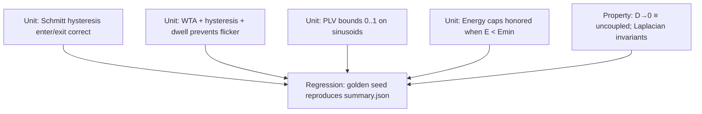

# Phase-Aware Polarity Homeostat
# Phase-Aware Polarity Homeostat

**Record → Decode (REST / REPAIR / PRUNE) → Correct chronic depolarization while preserving healthy oscillations.**

This repo implements and evaluates a **phase-aware bioelectric homeostat** for the Synthetic Biology course project.  
We treat tissues as **bioelectric–metabolic dynamical systems** and only intervene on **chronic depolarization** while preserving **physiological pulses** (ERK/ΔΨm rhythms) under **energy** and **geometry** safety rails.

---

## Background & Significance (course-aligned)

- **Biology**: Chronic depolarization covaries with disordered proliferation/migration; short/phasic depolarizations support repair and immune activation.  
- **Winfree logic**: Dynamics live on phase manifolds; control should be **phase-aware**, not amplitude-only.  
- **Engineering**: Detect chronic LOW-band occupancy, check oscillation health (PLV), require neighbor consensus, gate actions by energy.

**Course themes hit**: logic design (rule tree/MLP), oscillators & phase, IFFL/feedback (gates), multicellular communication (gap-junctions), load/fitness (energy cost).

---

## Specific Aims

1) **Aim A — Chronic vs phasic detector & event atlas**  
   Schmitt banding + leaky time-in-LOW + neighbor mismatch → ROC/PR separating chronic vs transient.

2) **Aim B — Phase-aware action gating & safe decoding**  
   Oscillation detector (PLV), neighbor consensus; decoders: rules **and** tiny MLP (WTA + hysteresis + dwell). Compare pulse-preservation vs flicker.

3) **Aim C — Energy safety & microenvironment**  
   Scalar energy store `E(t)` with actuation cost and optional TNT/EV flux; viability/safety maps; recovery vs naive clamps.

---

# MARMIT

> **Minimum Architecture, Requirements, Milestones, Interfaces & Testing**  
> With **spatial, box-and-arrow diagrams** (Mermaid). GitHub renders these.

## M — Minimal Architecture (boxes)

### M1. System Flow (top-level data path)

```mermaid
flowchart LR
  subgraph Tissue["Tissue State"]
    V["Vmem field (grid)"]
    E["Energy E(t) (grid)"]
  end

  V & E --> REC[Recorder\n- Schmitt bands (LOW/MID/HIGH)\n- Leaky time-in-LOW\n- Neighbor mismatch]
  V --> OSC[Oscillation Detector\n- Band-pass → analytic phase\n- PLV vs healthy]
  REC --> FEAT[Feature Vector\n<V̄, LOW_occ, mismatch, context, E, PLV>]
  OSC --> FEAT

  FEAT --> DEC{Decoder\nRules or Tiny MLP\nWTA + Hysteresis + Dwell}
  DEC -->|REST| MON[Monitor]
  DEC -->|REPAIR| GATES[Safety Gates\nEnergy / Oscillation / Geometry]
  DEC -->|PRUNE| GATES

  GATES -->|allow| ACT[Actuator\nBounded hyperpolarizing pulses\n(amplitude, duty, period, refractory)\n+ low-E caps]
  ACT -->|ΔV| V
  ACT -->|cost| E

  FEAT --> LOG[(Event Atlas CSV)]
  DEC --> LOG
```

### M2. Module Wiring (code-level boxes)

```mermaid
flowchart TB
  subgraph model/
    TISSUE[tissue.py\nRC grid + Laplacian + leak + noise]
    ENERGY[energy.py\nE dynamics + I_pump(E)]
  end

  subgraph sensing/
    RECORDER[recorder.py\nSchmitt + leaky LOW + mismatch]
    OSCILLATOR[osc.py\nFFT-Hilbert phase + PLV]
  end

  subgraph decoder/
    RULES[rules.py\nthreshold tree]
    MLP[perceptron.py\ntiny 6→H→3 + WTA/hyst/dwell]
  end

  subgraph safety/
    GATE[gates.py\nenergy/osc/geometry gates]
  end

  subgraph actuation/
    PULSES[pulses.py\nbounded pulses + caps]
  end

  subgraph eval/
    METRICS[metrics.py\nrecovery, flicker, PLV retention]
  end

  subgraph utils/
    MATH[math_utils.py\nLaplacian, ring buffers, analytic phase]
    IO[io_utils.py\natlas writer, summaries]
  end

  subgraph experiments/
    RUN[run.py\nCLI: config→modules→loop→logs]
  end

  TISSUE --> RECORDER
  TISSUE --> OSCILLATOR
  ENERGY --> TISSUE
  RECORDER --> RUN
  OSCILLATOR --> RUN
  RUN --> RULES
  RUN --> MLP
  RUN --> GATE
  GATE --> PULSES
  PULSES --> TISSUE
  PULSES --> ENERGY
  RUN --> IO
  RUN --> METRICS
  RUN --> MATH
```

---

## A — Requirements (what must be true)

```mermaid
flowchart LR
  R1[Detect chronic LOW without flagging short pulses]
  R2[Exactly one action active (WTA) with no flicker]
  R3[Block or cap actions when rhythms are healthy (PLV high)]
  R4[Block or cap when E < Emin (no zombie forcing)]
  R5[Avoid electrical islands: respect neighbor consensus]
  R6[Reproducible runs + event atlas + summary metrics]
```

**KPIs**

* ROC-AUC ≥ 0.9 for chronic vs transient classification.
* Flicker rate ≈ 0 in steady regimes (hysteresis + dwell).
* Pulse-preservation > naive clamp baseline.
* Zero unsafe actuation when `E < Emin`.

---

## R — Milestones (timeline as Gantt)

```mermaid
gantt
  title MARMIT Milestones
  dateFormat  YYYY-MM-DD
  section Skeleton
  M0: Repo layout, configs, stubs         :done,    m0, 2025-10-01, 1d
  section Sensing
  M1a: Tissue + Energy integrators        :active,  m1a, 2025-10-02, 2d
  M1b: Recorder + Oscillator + Atlas      :         m1b, 2025-10-04, 2d
  section Decision & Safety
  M2a: Rule decoder + tests               :         m2a, 2025-10-06, 1d
  M2b: Tiny MLP + WTA/hyst/dwell          :         m2b, 2025-10-07, 1d
  M2c: Energy/PLV/Geometry gates          :         m2c, 2025-10-08, 1d
  section Actuation & Metrics
  M3a: Bounded pulses + caps              :         m3a, 2025-10-09, 1d
  M3b: Recovery/flicker/PLV summaries     :         m3b, 2025-10-10, 1d
  section Experiments
  M4: Sweeps (D × Emin × duty, TNT flux)  :         m4,  2025-10-11, 3d
```

---

## I — Interfaces (configs, CLI, outputs)

### Config (YAML contract)

```yaml
seed: 1337

tissue: { grid: [10,10], dt: 0.005, steps: 3000, EL: -60.0, gL: 0.05, coupling_D: 0.2, noise_rms: 1.0, boundary: periodic }
energy: { E0: 0.7, k_oxphos: 0.2, alpha_actuation_cost: 0.05, beta_tnt_flux: 0.0, gamma_decay: 0.01, Emin: 0.3 }

recorder: { low_enter: -15.0, low_exit: -8.0, tau_low: 600.0, mismatch_threshold: 5.0 }
osc:      { window_seconds: 1200.0, healthy_plv_min: 0.5, downsample: 20 }

decoder:
  type: rules         # rules | perceptron
  hysteresis_margin: 0.05
  decision_dwell: 50
  perceptron: { hidden: 8 }
  rules:      { low_occ_threshold: 200.0, energy_ok: 0.35, mismatch_ok: 5.0 }

actuation:
  amplitude_mV: -10.0
  duty: 0.1
  period_s: 300.0
  refractory_s: 600.0
  cap_when_lowE: { amplitude_mV: -4.0, duty: 0.05 }

safety:  { enable_energy_gate: true, enable_osc_gate: true, enable_geometry_gate: true }
logging: { atlas_stride: 10 }
```

### CLI (single source of truth)

```bash
python -m polarity_homeostat.experiments.run \
  --config configs/exp_baseline.yaml \
  --out results/exp_baseline
```

**Outputs**

* `event_atlas.csv`: t, action, mean_V, LOW_occ, mismatch, E, PLV
* `summary.json`: recovery_time_step, flicker_rate, PLV_retention, final_mean_V, final_mean_E

---

## T — Testing (unit, property, regression)



**Target coverage**: ≥80% for logic modules (recorder, decoder, gates).  
**Golden run**: one fixed seed & config committed for deterministic regression.

---

## Preliminary Results Plan (for the course)

* **Event atlas & ROC/PR** (chronic vs transient).
* **Decision regions** (rules vs tiny MLP) + **flicker rate**.
* **Recovery curves** (bounded pulses vs clamps; pulse-preservation).
* **Safety envelopes** (E_min, duty, coupling D; TNT/EV scenarios).

---

## Repository Layout (to implement)

```
configs/
src/polarity_homeostat/
  model/        # tissue.py, energy.py
  sensing/      # recorder.py, osc.py
  decoder/      # rules.py, perceptron.py
  safety/       # gates.py
  actuation/    # pulses.py
  eval/         # metrics.py
  utils/        # math_utils.py, io_utils.py
  experiments/  # run.py
tests/          # test_hysteresis.py, test_wta.py, test_plv.py
results/        # (gitignored)
figures/        # (gitignored)
```

---

## Usage (once code lands)

```bash
python -m venv .venv && source .venv/bin/activate
pip install -r requirements.txt
python -m polarity_homeostat.experiments.run --config configs/exp_baseline.yaml --out results/exp_baseline
```

---

### Notes
- The **Mermaid blocks** (flowchart + wiring + sequence/gantt) will render on GitHub.
- If you want **even more “spatial” detail**, I can add:
  - a **sequence diagram** of one simulation step, and
  - a **state diagram** for the decoder’s WTA + hysteresis + dwell.
- Want me to append those too?

**Record → Decode (REST / REPAIR / PRUNE) → Correct chronic depolarization while preserving healthy oscillations.**

This repository hosts the modeling code and proposal materials for our synthetic biology term project.  
The system treats tissues as **bioelectric–metabolic oscillators** and implements a controller that distinguishes between **chronic depolarization** (pathologic) and **phasic pulses** (beneficial for repair/immune activation).

---

## Background & Significance

- **Biological motivation**  
  - Chronic depolarization of membrane potential (V_mem) correlates with disordered proliferation, migration, and mispatterning.  
  - Short depolarizing pulses, however, encode healthy proliferation (ERK frequency codes), wound repair, and immune activation.  
  - Winfree’s *Geometry of Biological Time* shows that biological cycles behave as phase oscillators on manifolds—control should be **phase-aware**, not blunt.  

- **Engineering framing**  
  - We formalize a tissue as an **RC-membrane grid with gap-junction coupling** and a lightweight **energy store E(t)**.  
  - The project explores how to implement a **synthetic homeostat** that only acts when:  
    1. depolarization is **chronic**,  
    2. rhythms are **out of coherence**,  
    3. **energy is sufficient**, and  
    4. **neighbors agree**.

This directly addresses course themes from **Principles of Synthetic Biology (BioE 147/247)**: logic design, oscillators, IFFL/feedback, multicellular communication, load/fitness effects.

---

## Specific Aims

1. **Aim A — Chronic vs phasic event detection**  
   Implement a recorder that quantizes V_mem into LOW/MID/HIGH bands (Schmitt comparators), integrates **time-in-LOW** with leaky accumulators, and discriminates chronic depolarization from transient pulses.  
   **Deliverable:** ROC/PR curves separating chronic vs transient events.

2. **Aim B — Phase-aware gating & safe decoding**  
   Add oscillation coherence (PLV) and neighbor consensus metrics; implement two decoders: (i) interpretable rules, (ii) a tiny quantized perceptron.  
   **Deliverable:** comparison of decision stability (flicker rate) and pulse-preservation.

3. **Aim C — Energy safety and microenvironment**  
   Integrate a simple scalar energy store E(t) with actuation costs and optional TNT/EV flux.  
   **Deliverable:** viability maps and control trade-offs under different energy/microenvironmental conditions.

---

## Approach & Model

- **Model:** 2-D RC-membrane grid with leak, noise, and gap-junction coupling.  
- **Energy:** scalar E(t) per cell, updated with OXPHOS supply, actuation cost, TNT/EV flux.  
- **Recorder:** banding via Schmitt thresholds + leaky integral of LOW occupancy + neighbor mismatch.  
- **Oscillation detector:** analytic phase (FFT-Hilbert), phase-locking value (PLV).  
- **Decoder:** either transparent rules or 2-layer MLP with quantized weights, WTA + hysteresis + dwell.  
- **Actuation:** bounded hyperpolarizing pulses with duty/period/refractory, capped when E < Emin.  
- **Safety rails:** energy gate, oscillation guard, geometry consensus.  
- **Outputs:** event atlas (CSV) and summary metrics (JSON).

---

## Preliminary Results Plan

We will generate synthetic datasets to demonstrate feasibility:
- **Event atlas & ROC** separating chronic vs phasic depolarizations.  
- **Decision regions** for rule vs perceptron decoders; measure flicker vs stability.  
- **Recovery dynamics**: V_mem trajectories showing bounded pulses restore healthy band without suppressing short transients.  
- **Safety envelopes**: parameter sweeps over E_min, duty, coupling D to map safe vs unsafe zones.

These results satisfy the course’s **Preliminary Results** requirement with modeling-only outputs.

---

## Repository Layout (planned)

```

configs/             # YAML configs
src/polarity_homeostat/
model/             # tissue.py, energy.py
sensing/           # recorder.py, osc.py
decoder/           # rules.py, perceptron.py
actuation/         # pulses.py
safety/            # gates.py
eval/              # metrics.py
utils/             # math_utils.py, io_utils.py
experiments/       # run.py (CLI entrypoint)
tests/               # unit tests (hysteresis, WTA, PLV)
results/             # outputs (gitignored)
figures/             # plots (gitignored)

````

---

## Grading Alignment (BioE 147/247)

- **Background & Significance:** voltage, oscillations, gap-junction domains, energy & organelle exchange.  
- **Specific Aims:** A–C above, each testable with modeling.  
- **Preliminary Results:** synthetic event atlas, decision regions, recovery curves, safety maps.  
- **Course Themes Addressed:** combinational logic (rule-tree), toggle/oscillators (phase-aware pulses), feedback/load (energy gate), multicellular coordination (gap-junction mismatch).

---

## Usage (future)

```bash
python -m venv .venv && source .venv/bin/activate
pip install -r requirements.txt

# Run baseline experiment
python -m polarity_homeostat.experiments.run \
  --config configs/exp_baseline.yaml \
  --out results/exp_baseline
````

Outputs:

* `event_atlas.csv` – features and chosen actions over time
* `summary.json` – recovery time, flicker rate, PLV retention, final V/E

---

