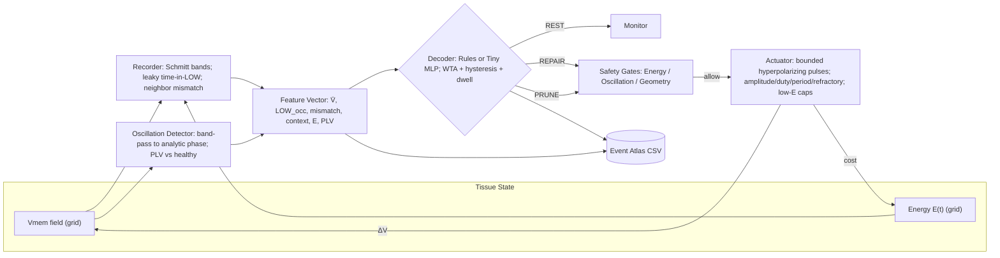
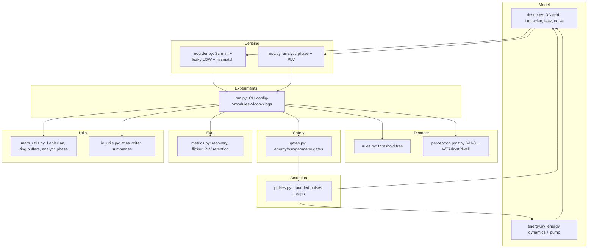
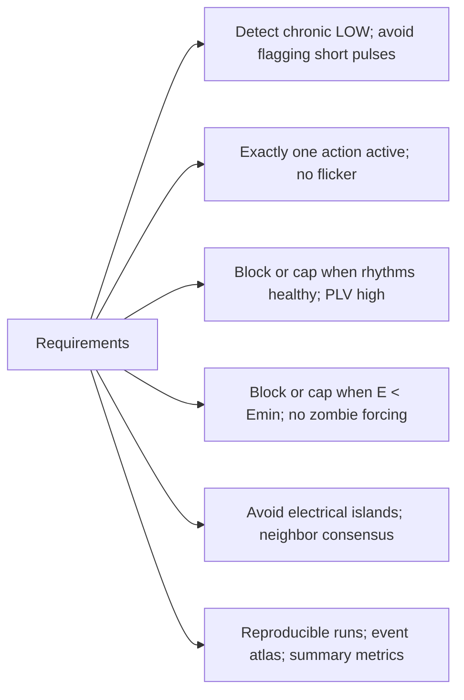
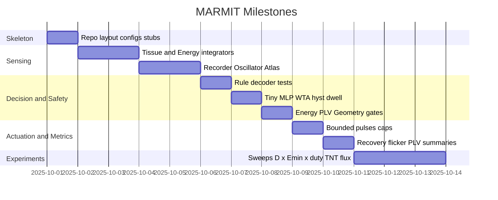
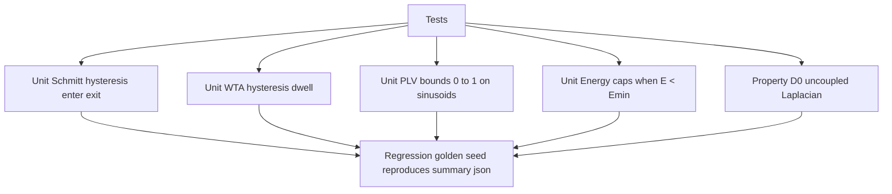

# Phase-Aware Polarity Homeostat

**Record → Decode (REST / REPAIR / PRUNE) → Correct chronic depolarization while preserving healthy oscillations.**

This repo implements and evaluates a **phase-aware bioelectric homeostat** for our **Principles of Synthetic Biology (BioE 147/247)** term project.  
We treat tissues as **bioelectric–metabolic dynamical systems** and only intervene on **chronic depolarization** while preserving **physiological pulses** (ERK/ΔΨm rhythms) under **energy** and **geometry** safety rails.

---

## Background & Significance (course-aligned)

- **Biology.** Chronic depolarization covaries with disordered proliferation/migration; short/phasic depolarizations support repair and immune activation.  
- **Winfree logic.** Dynamics live on phase manifolds; control must be **phase-aware**, not amplitude-only.  
- **Engineering goal.** Detect chronic LOW-band occupancy, check oscillation health (PLV), require neighbor consensus (gap-junction domain), and **gate actions by energy** to avoid "zombie forcing".

**Course themes hit:** logic design (rule-tree / tiny MLP), oscillators & phase, IFFL/feedback (safety gates), multicellular communication (gap-junctions), load/fitness (energy costs).

---

## Specific Aims

1) **Aim A — Chronic vs phasic detector & event atlas**  
   Schmitt banding + leaky time-in-LOW + neighbor mismatch → ROC/PR separating chronic vs transient.

2) **Aim B — Phase-aware action gating & safe decoding**  
   Oscillation detector (PLV), neighbor consensus; decoders: rules **and** tiny MLP (WTA + hysteresis + dwell). Compare pulse-preservation vs flicker.

3) **Aim C — Energy safety & microenvironment**  
  Scalar energy store `E(t)` with actuation cost and optional TNT/EV flux; viability/safety maps; recovery vs naïve clamps.

---

# MARMIT

> **Minimum Architecture, Requirements, Milestones, Interfaces & Testing**  
> With **spatial, box-and-arrow diagrams** (Mermaid). GitHub renders these.

## M — Minimal Architecture (boxes)

### M1. System Flow (top-level data path)



### M2. Module Wiring (code-level boxes)



---

## A — Requirements (what must be true)



**KPIs**

* ROC-AUC ≥ 0.9 (chronic vs transient classification)
* ≈ 0 flicker in steady regimes (hysteresis + dwell)
* Pulse-preservation > naïve clamp baseline
* 0 unsafe actuation when E < Emin

---

## R — Milestones (timeline as Gantt)



---

## I — Interfaces (configs, CLI, outputs)

### Config (YAML contract)

```yaml
seed: 1337

tissue: { grid: [10,10], dt: 0.005, steps: 3000, EL: -60.0, gL: 0.05, coupling_D: 0.2, noise_rms: 1.0, boundary: periodic }
energy: { E0: 0.7, k_oxphos: 0.2, alpha_actuation_cost: 0.05, beta_tnt_flux: 0.0, gamma_decay: 0.01, Emin: 0.3 }

recorder: { low_enter: -15.0, low_exit: -8.0, tau_low: 600.0, mismatch_threshold: 5.0 }
osc:      { window_seconds: 1200.0, healthy_plv_min: 0.5, downsample: 20 }

decoder:
  type: rules         # rules | perceptron
  hysteresis_margin: 0.05
  decision_dwell: 50
  perceptron: { hidden: 8 }
  rules:      { low_occ_threshold: 200.0, energy_ok: 0.35, mismatch_ok: 5.0 }

actuation:
  amplitude_mV: -10.0
  duty: 0.1
  period_s: 300.0
  refractory_s: 600.0
  cap_when_lowE: { amplitude_mV: -4.0, duty: 0.05 }

safety:  { enable_energy_gate: true, enable_osc_gate: true, enable_geometry_gate: true }
logging: { atlas_stride: 10 }
```

### CLI (single source of truth)

```bash
python -m polarity_homeostat.experiments.run \
  --config configs/exp_baseline.yaml \
  --out results/exp_baseline
```

**Outputs**

* `event_atlas.csv`: t, action, mean_V, LOW_occ, mismatch, E, PLV
* `summary.json`: recovery_time_step, flicker_rate, PLV_retention, final_mean_V, final_mean_E

---

## T — Testing (unit, property, regression)



**Target coverage**: ≥80% for logic modules (recorder, decoder, gates).  
**Golden run**: one fixed seed & config committed for deterministic regression.

---

## Preliminary Results Plan (for the course)

* **Event atlas & ROC/PR** (chronic vs transient).
* **Decision regions** (rules vs tiny MLP) + **flicker rate**.
* **Recovery curves** (bounded pulses vs clamps; pulse-preservation).
* **Safety envelopes** (E_min, duty, coupling D; TNT/EV scenarios).

---

## Repository Layout (to implement)

```
configs/
src/polarity_homeostat/
  model/        # tissue.py, energy.py
  sensing/      # recorder.py, osc.py
  decoder/      # rules.py, perceptron.py
  safety/       # gates.py
  actuation/    # pulses.py
  eval/         # metrics.py
  utils/        # math_utils.py, io_utils.py
  experiments/  # run.py
tests/          # test_hysteresis.py, test_wta.py, test_plv.py
results/        # (gitignored)
figures/        # (gitignored)
```

---

## Usage (once code lands)

```bash
python -m venv .venv && source .venv/bin/activate
pip install -r requirements.txt
python -m polarity_homeostat.experiments.run --config configs/exp_baseline.yaml --out results/exp_baseline
```

